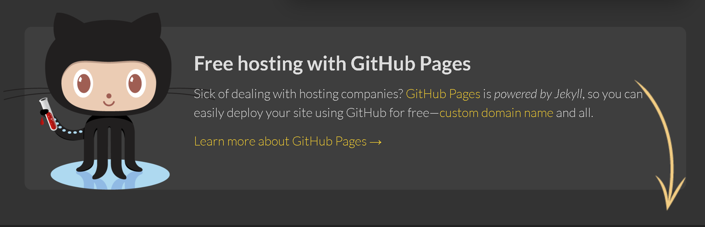

## Jekyll 是什么

我的博客是托管在Github Pages上的，使用了一种叫做`Jekyll`的技术构建。最近由于系统邮件一直告诉我有安全漏洞，需要升级，所以我到处找合适的升级模板。

个人理解，Jekyll 基于`Ruby`开发的，一种和Github Pages 组合使用的代码生成器。能够将markdown格式的文档，生成为html的静态网页。它的特性或者说是适用场景是明确的：

- MarkDown格式作为输入，最终转换成HTML
- 部署在Github Pages
- 不支持动态技术（ASP/PHP）

## 安装Jekyll

为了能够升级和调试现有的`Jekyll`，需要在本地部署它的构造环境。这个事情只需要做一次，所以可以在虚拟机中进行。

由于我已经部署过`kukisama.github.io`这个库，也配置过自定义域名这些，对在Github中的操作不做过多叙述。

另外我是在Windows下安装Jekyll，所以首先要前往https://jekyllrb.com/docs/installation/windows/查看说明，这里有详细的安装步骤。整个安装步骤比较简单。

1、[从RubyInstaller Downloads](https://rubyinstaller.org/downloads/)下载并安装**Ruby+Devkit**版本。使用默认选项进行安装。

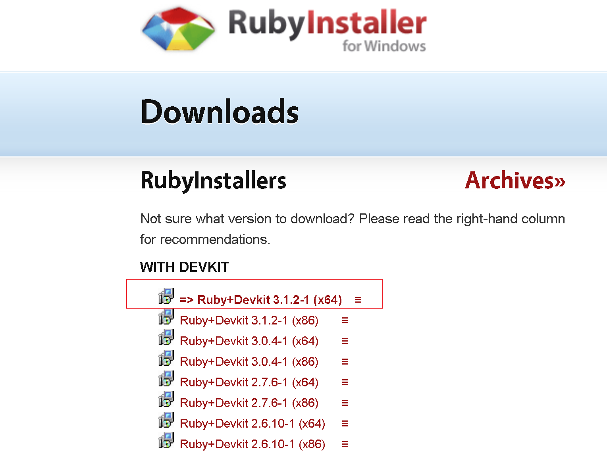

2、 安装结束后会有一个弹窗，3选1，我们选择`MSYS2 and MINGW development tool chain`。如果不小心关掉了，可以在cmd里面运行`ridk install` 重新把这个向导拉起来

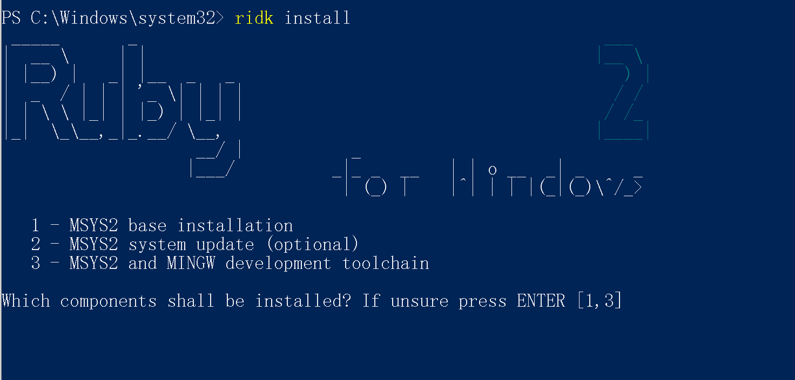

3、 再执行一下`gem install jekyll bundler`，这是`核心步骤`

4、 最后执行`jekyll -v`，看是否成功安装

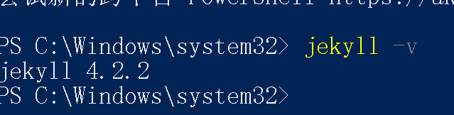


## 配置安装Jekyll

完成环境安装之后，接下来要开始做基础配置。

操作都在PowerShell下执行，一行一行做，相对比较简单。下面的流程说明是针对一个一穷二白的空`Jekyll`而言的。

```powershell
#首先创建一个c:\work的目录，然后前往这个目录。
cd c:\work
#用jekyll初始化博客站点kukisama.github.io，在做这个操作之前，要提前用VScode将整个kukisama.github.io拉回来，也就是说，kukisama.github.io目录是实际存在的。
jekyll new kukisama.github.io
#前往这个目录
cd kukisama.github.io
#将这个目录变成可用的http站点，直接访问下面的地址即可看到实际效果
#http://localhost:4000
bundle exec jekyll serve

# 如果系统是Ruby 3.0.0，且发现服务器起不来，输入这条命令
# bundle 本身会在各种回显上进行提示，如果有报错，注意看下错误信息中关于bundle 的内容，按照提示可以修复错误。
bundle add webrick
#因为本身Jekyll是个代码生成器，修改MD并不是立刻映射到html文件上。
#可以用这条命令启动服务，这样文件被改变之后，会即刻刷新网页
bundle exec jekyll serve --livereload
```

可以用下面这个链接，进行测试

http://localhost:4000


 ## 套用chirpy模板

和`Wordpress`类似，要想输出好看，自己又不会写代码，就需要自己找个模板套上去。

之前用的模板是https://github.com/onevcat/vno-jekyll的模板，大概是这个样子的。问题在于这个版本已经很久不更新了，然后`Github`报告站点用的模块有漏洞，必须要升级修复。因为没有新版本，所以只能更换。

 

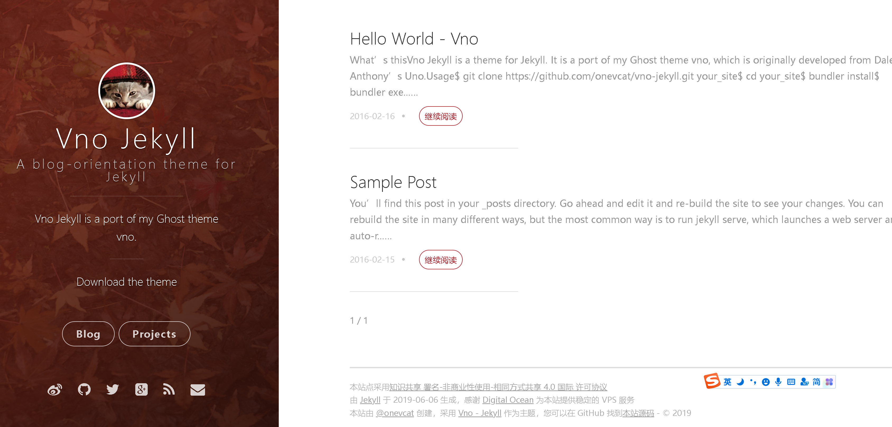

戏剧性的是，`Vno-jekyll`的作者自己也不用这个模板了，他用了 [Chirpy](https://github.com/cotes2020/jekyll-theme-chirpy/) 作为主题，感觉两个主题差不多，而且我不太想在这个事情上花太多功夫，我就也准备用 [Chirpy](https://github.com/cotes2020/jekyll-theme-chirpy/) 


这次犯了`经验主义错误`，我首先去Github找Chirpy的项目 https://github.com/cotes2020/jekyll-theme-chirpy ，然后按照以前使用`Vno-jekyll`的惯例，直接把整个站点代码克隆下来，放到自己的本地Jekyll目录中了，然后`上传`，等待`同步`。

很显然这么搞失败了，而且在问题列表中看到，也有人和我出现一样的错误。花了`一天半`也没有搞定.

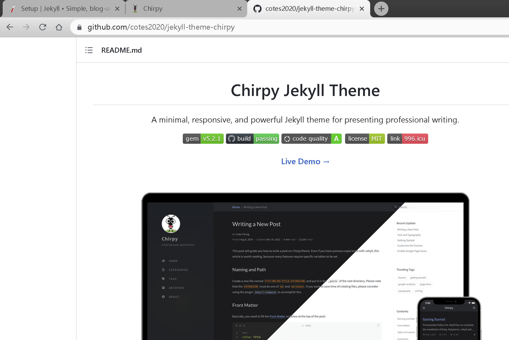


没办法只能回来认真看文档，第一步就发现不一样了。我所在的项目叫`jekyll-theme-chirpy`，但是它需要克隆的代码库叫做[**Chirpy Starter**](https://github.com/cotes2020/chirpy-starter/generate) ……


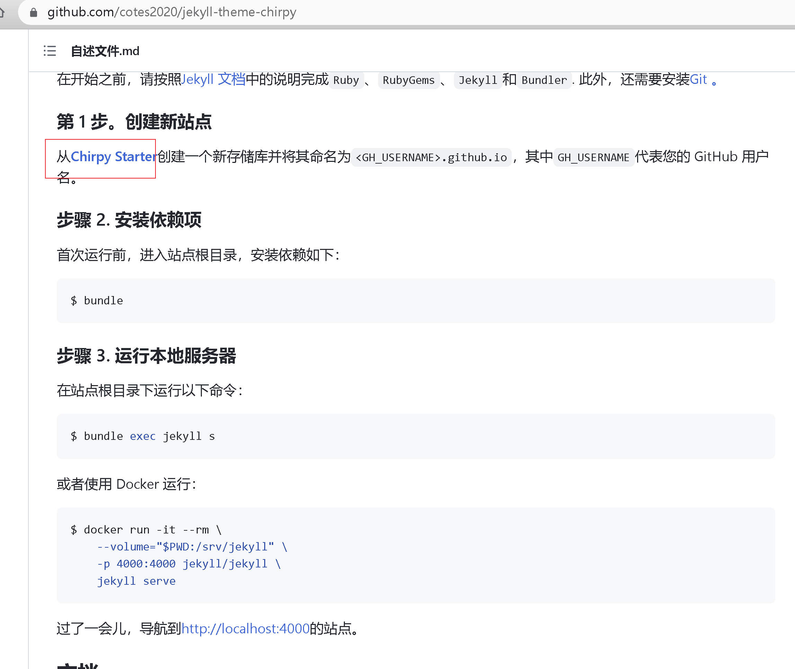

按照提示，创建这个特定的存储库，然后看到有`这么一句`，我来到[演示网站](https://cotes2020.github.io/chirpy-demo/)，这会才真的算是找对了方向。也就是说，它的真正的部署手册是https://chirpy.cotes.page/posts/getting-started/ 

> 更多使用方法请参考[演示网站](https://cotes2020.github.io/chirpy-demo/)/ [wiki](https://github.com/cotes2020/jekyll-theme-chirpy/wiki)上的教程
>
> 

另外 https://github.com/cotes2020/jekyll-theme-chirpy/tree/master/_posts  这里有这个模板适用的相关语法可供查询，对应的前端页是https://chirpy.cotes.page/

##  梳理模板部署过程

根据官方文档和实践，整理一下这个测试确认好使的部署过程：

- 首先用[**Chirpy Starter**](https://github.com/cotes2020/chirpy-starter/generate)  创建特定存储库

- 用VSCODE把代码拉回来

- 提前配置安装`Jekyll`环境

- 前往克隆回来的本地代码库目录

  - 执行`bundle` 安装依赖
  - 修改代码库目录中 `_config.yml`文件中 `url`部分，改成自己的`xxx.github.io`
    - `_config.yml`有很多自定义选项，都不是太复杂，根据例子自行修改就可以了
    - 不同模板的`_config.yml`都不一样，大家的定义不一样，不能想当然的照抄，只能看模板作者的例子。
  - 因为我的电脑是windows，所以要运行一次 `bundle lock --add-platform x86_64-linux`
  - 虽然我的站点有自定义域名，但是注意以前的配置方式（配置CNAME文件）已经失效了，在`_config.yml`文件中只需要定义`xx.github.io`
  - 确保站点有 `.github/workflows/pages-deploy.yml`这个文件。
    - 其值`on.push.branches`应与您的 repo 的默认分支名称相同
    - 由于以前的`master`这个分支名被改成了比较中性的`main`，新弄的库都是`main`，老一点的是`master`，这里如果不一样，会导致`Github Action`无法触发。只能说大家都是受害者。

- `任意`做一个修改,比如在`POST`目录提交一个文档，然后用VScode提交一次合并，会自动触发`Github Action`自动化的执行一些作业。

  - 这个时候，打开在 GitHub 上的存储库。选择选项卡*Settings*，然后单击左侧导航栏中的*Pages*，然后在*GitHub Pages的`源`中，选择`gh-pages`的目录作为[发布源](https://docs.github.com/en/github/working-with-github-pages/configuring-a-publishing-source-for-your-github-pages-site)。离开前记得点击。`/(root)``gh-pages`Save。

    [](https://raw.githubusercontent.com/cotes2020/chirpy-images/main/posts/20190809/gh-pages-sources.png)

  - 之前用的`Vno-jekyll`有很多年了，也可能是这两年的架构演进。`chirpy`的逻辑是主线发布不做任何修改，实际会生成站点目录结构的html文件到`gh-pages`分支上。至少以前是没有这种自动创建新分支并发布的逻辑的。

  - 不太懂html，但是觉得这种逻辑生成的html，由于不需要做任何运算，单纯展示，连地址栏都不需要做转换，应该速度会比动态生成的快一些。


## 对比代码差异

事实上我对于只能用 `chirpy-starter-main`部署，而不能用`jekyll-theme-chirpy-master`部署比较好奇，这两者的差异应该怎么分辨呢？

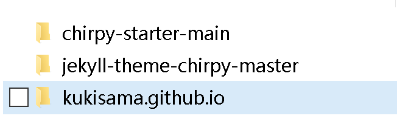

可以使用`Beyond Compare 4`来进行文件对比，当然其他任何能够做对比的软件都可以。经过对比之后，发现两边的文件不能说是一模一样，只能说是差之千里。

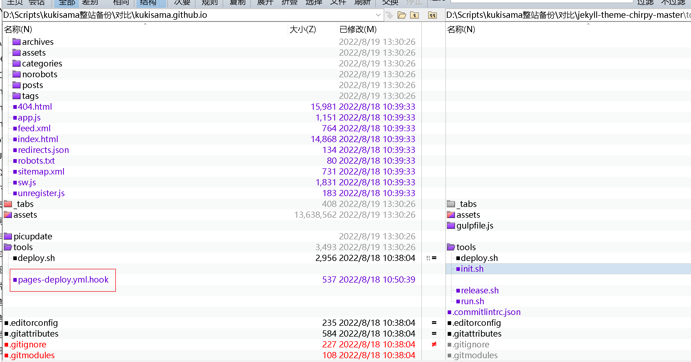

比如上面文档中提到的`.github/workflows/pages-deploy.yml`这个文件。`chirpy-starter-main`用的分支是`main`，而`jekyll-theme-chirpy-master`用的是`master`，这个可能是关键差异，除此之外的差异还包括`jekyll-theme-chirpy-master`使用了更多的插件，直接套用也可能有兼容性问题，由于我对html所知甚少，所以也就不再深挖。

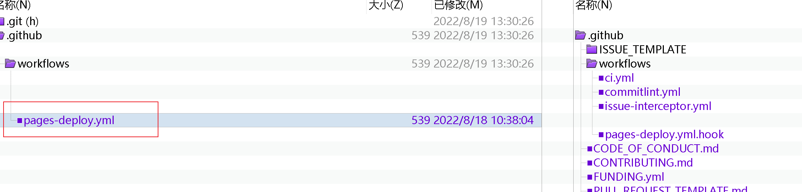


## Github Action 问题处理

在部署过程中，通过给`POST`目录上传`markdown`文档，我发现偶尔会部署失败。通过检查检查`Action`的部署过程，发现这是个不错的排错的窗口。

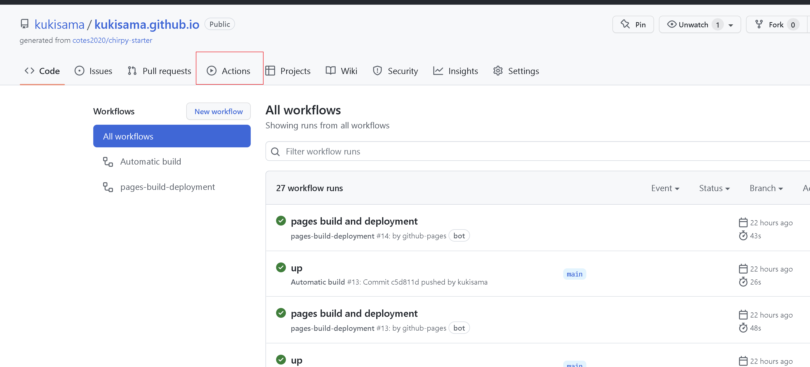


例如发现`Deploy`有错误，展开之后可以看到，错误提示是 `Html-proofer found 1failure`。通过仔细看代码，发现是超链接前面多了一个`#`，在`Markdown`中，这个错误并不致命，也不影响显示，但是在代码生成过程中就出错了。解决方法就是回去修改`POST`目录下的实际文件，修改好后VScode重新提交更改。等待刷新。

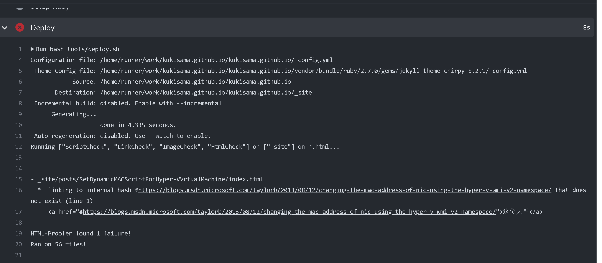

 

 

## Jekyll 主题

以下是一些主题站	

- jekyllthemes.org http://jekyllthemes.org/
- jekyllthemes.io https://jekyllthemes.io/
- jekyll-themes.com https://jekyll-themes.com/
- Start Bootstrap https://startbootstrap.com/
- Github https://github.com/topics/jekyll-theme
- jekyll-TeXt-theme https://github.com/kitian616/jekyll-TeXt-theme


推荐最后一个， [TeXt Theme](https://tianqi.name/jekyll-TeXt-theme/) 它最大最大的好处是，中文！

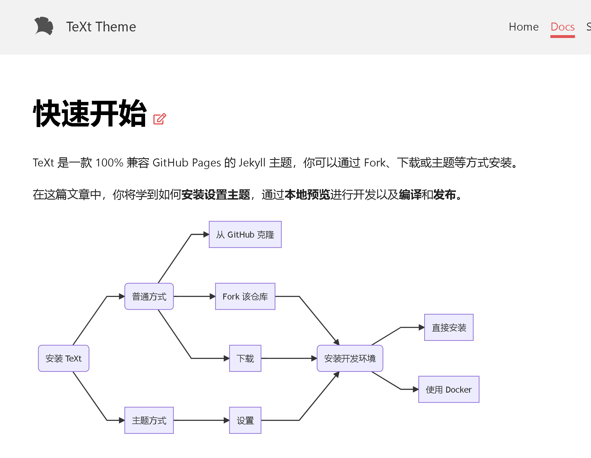


