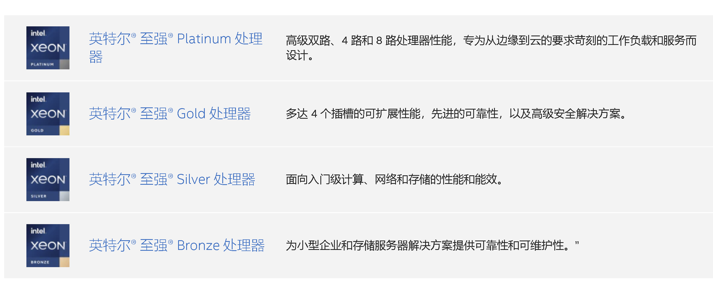
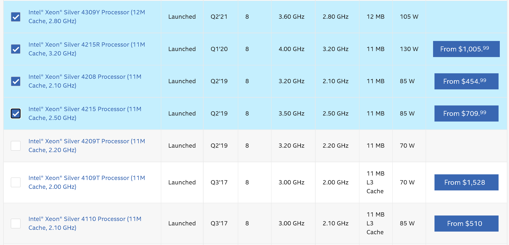
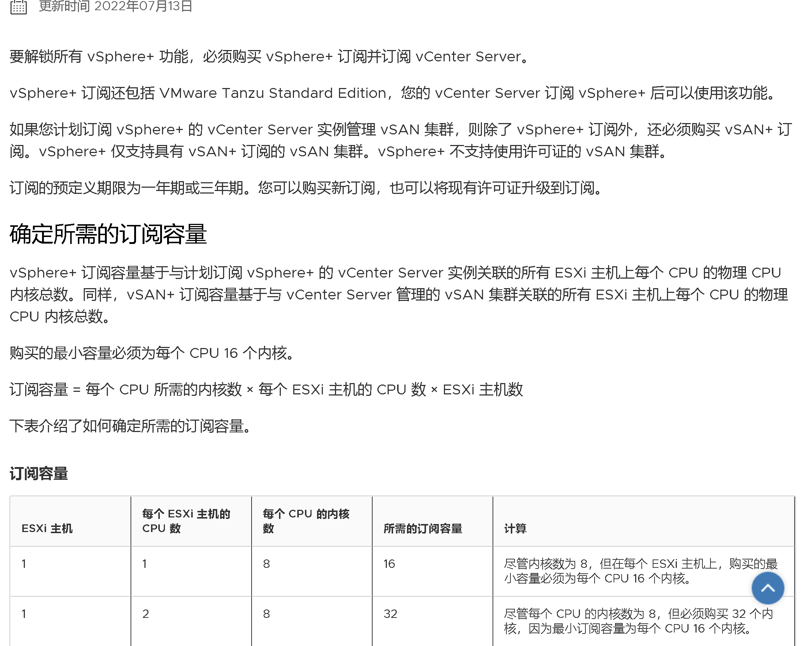

不是一个人，而是很多朋友在了解HCI产品后，会觉得AzureStack HCI的价格很高，难落地。

有时候`感觉`是不太准的，所以我们来详细818 Azure Stack HCI的计费方式，以及这个东西的影响。为了详细的分析，这个事情要分两个方面讨论

- 跟谁比
- 怎么用

通过计算，我也希望找到触碰到Azure Statck HCI `底线`的配置。底线顾名思义，就是到头了，不能再省钱了，再省钱就影响功能了。


## Azure Stack HCI的计费方式

`超融合基础架构`（Hyper-converged infrastructure，缩写为HCI）是SDX（软件定义一切）时期的附加产物，其特点是计算、存储、网络的提供能力是`等比`、`线性`提升的，什么意思？拿挖矿来类比，就是1个节点算力为1，两个节点就是2，没有损耗。简单并且易于使用。用户可以根据实际需求，往群集增加节点，来实现整体群集运算能力的提升。

所以它背后隐藏了一些高级功能的说明，比如分布式存储、网络虚拟化、计算虚拟化、管理平台，当然还有针对本身平台的高可用属性。所以HCI是一种`一揽子工程`，是一种相对高级的实现方式，是对纯虚拟化产品的一种升级。

Azure Stack HCI的计费方式简单粗暴，按照用量计费。

> - 从Azure账户中合并计费
> - 每个物理主机按照1核心`10美元`收取`月租`

除了这个费用，再没有其他的了。和传统虚拟化一哥`VMWare`的针对虚拟化和VSAN单独计费、并且有最低16物理核低消相比，灵活性和价格都是占优的。

以一台 机器两颗16核的[Intel® Xeon® Gold 6326 )](https://www.intel.com/content/www/us/en/products/sku/215274/intel-xeon-gold-6326-processor-24m-cache-2-90-ghz/specifications.html)， 汇率6.86来算，一年的许可证费用无折扣是`16*2*6.86*10*12=26343`，这个价格不过不失，属于正常授权的价格，如果公司有Azure的折扣，那么这个折扣也可以映射到这里。

## 选什么CPU？

Intel的CPU细节我们可以参考 [Intel Ark](https://ark.intel.com/content/www/us/en/ark.html) 。



选择CPU其实很简单，注意几个指标就可以了：

- 发布时间：俗话说买新不买旧
- 功耗：同技术代差，理论上功耗越高性能越好。毕竟服务器不图省电
- 价格：这个没什么可说的，量力而行。
- 核心数：至少8核（后面会解释为什么）

有的朋友说，我想`AMD yes`行不行？只能说一半一半，CPU的选型远不止总算力这么简单。


比如AMD官网宣传的[产品对比](https://www.amd.com/en/processors/epyc-7003-series)，AMD用多出的24个核心，跑出来比Intel更好的成绩，并且提供了更低的价格（接近3000美元）。但是依然要说，单核性能上，Intel还是大哥。

| CPU                                                          | 价格                                                         | 核心 |
| ------------------------------------------------------------ | ------------------------------------------------------------ | ---- |
| [**AMD EPYC 7763**](https://www.cpubenchmark.net/cpu.php?cpu=AMD+EPYC+7763) | [$5,599.00 USD](https://www.cpubenchmark.net/cpu.php?cpu=AMD+EPYC+7763#history) (2022-08-23) | 64C  |
| [**Intel® Xeon® Platinum 8380**](https://www.intel.com/content/www/us/en/products/sku/212287/intel-xeon-platinum-8380-processor-60m-cache-2-30-ghz/specifications.html) | [$8,978.00 USD](https://www.cpubenchmark.net/cpu.php?cpu=Intel+Xeon+Platinum+8380#history) (2022-04-03) | 40C  |

回到授权（正版授权）上，无论微软还是VMWare，都是以CPU核心数来授权，因此AMD的这种架构就比较吃亏了。以那多出来的24个核心来计，每年正版授权支出需要多`24*2*10*12=5760`美元，买CPU省下来的钱`一年就干秃噜`了。


## 单纯的分布式存储架构

HCI既然是`软件定义的计算`，`软件定义的存储`，`软件定义的网络`，那这些东西能不能拆开用呢？答案是肯定的。  那就是用HCI做超融合存储。

是的，就是`单纯的存储`，不使用网络虚拟化功能。因为HCI有完整的`Iscsi`和`SOFS`功能，且可以在群集模式下提供服务，并且不限定存储的连接放。作为传统企业，这其实也有比较大的应用市场。那么它的直接对手，就是`VSAN`

这里为了最大化成本优势，需要依据授权方式，`计算最合理的CPU选型`。

对于HCI的CPU选型，其实有一个`最低的底线`，那就是CPU性能至少要保证分布式存储S2D能够正常工作。那怎么算正常工作呢，首先需要保证`网卡的对内对`外通信没有问题。

为了降低网络对CPU的影响，出现了一种网卡专有技术，叫做`RDMA`，我们不去细聊RDMA是什么，只需要知道，买的网卡上有这项功能，那么同样支持RDMA的网卡之间通信，就可以享受到低延迟，低CPU占用的特性。

HCI的部署，一般我们推荐使用`iwarp`,这单纯就是因为省事儿，部署简单。`ROCE`需要更多经验丰富的人去配置，以及需要底层硬件的支持，所以并不适合中小规模的部署。

作为两种芯片都生产的Marvell，它发布了两者的对比差异。相对来说，观点比较中立，可供阅读。[RoCE 或 iWARP 的低延迟？- Marvell博客](https://blogs.marvell.com/2019/04/roce-or-iwarp-for-low-latency/)


问题来了，既然RDMA可以极大降低CPU的利用率，那CPU岂不是随便买都都可以？这个时候要注意了，`RDMA`只会对同样开启`RDMA`的对端设备生效，也就是RDMA只是在自己的范围内生效，在HCI的场景中，就是HCI内部的分布式存储S2D通信，才会用到RDMA，如果和HCI以外的机器通信，就回到传统网络中来，没有`RDMA`可用了。

虽然Intel最低端的CPU是 [Intel® Xeon® Silver 4112 Processor )](https://www.intel.com/content/www/us/en/products/sku/123551/intel-xeon-silver-4112-processor-8-25m-cache-2-60-ghz/specifications.html)，但作为HCI的CPU选型，我们`无论如何`是不能选它的。


它仅仅只有4个核心，连10G的带宽都跑不满（ [【网络实验】10G网络下的真实带宽——CPU负载与网卡TSO、GSO](https://blog.csdn.net/satsuma_samurai/article/details/74942601)）。

单个CPU核心只能支撑接近2.5G的网卡流量，分配5个核心才可以跑满10G。这种配置下，选配一个高主频，核心少的CPU才能满足接近20G的流量需求。

`20G这个标准`怎么来的？这是因为多数情况，我们都会`至少`购买一张双网口，单口10G的卡。如果卡的规格提升，那么CPU的规格也要同比提升。

所以说，`8核`是Azure Stack HCI的底线，一台主机不能少于8核，要不就会极大影响性能的发挥了。至于选什么，还是依照上面给出的建议，选择价格合适，主频够高的产品。



## 分布式存储的整个群集计费

单纯以分布式存储而言，AzureStack HCI拥有`无与伦比`的价格优势。

以一个群集`3个`节点，每个节点配备一颗`8核`的CPU来计算，一年只需要 `8*3*6.86*10*12=19,756`，还没有突破2万大关。这个价格对企业级的商业分布式存储用户而言，不能说贵到天际，只能说是基本白送。


 ## 超融合架构

如果需要很好的利用超融合架构的计算功能，那么除了每个节点`预留8核`之外，其他的资源都可以用来做计算能力的输出。这种计费没有低消，也只需要根据用量付费，销毁主机后即停止计费。


## VMWare收费方式 

了解一下友商的定价方式，就知道Azure Stack HCI处于什么级别。[VMware购买订阅](https://docs.vmware.com/cn/VMware-vSphere+/services/vsphereplus-getting-started/GUID-5FE50378-BA49-4A79-B33B-0D8BB60C0075.html)



## 网卡选择

知乎有一位朋友分享了现在主流网卡对RDMA的支持，方便大家了解和选购。[19. RDMA之iWARP & Soft-iWARP - 知乎 (zhihu.com)](https://zhuanlan.zhihu.com/p/449189540)

网卡的选择只是一个简单的二选一，`iwarp`或者`ROCE`。

> 这些驱动程序所属的厂家（括号外的公司被括号内的公司收购或者为其子公司）如下：
>
> | 驱动名     | 厂商              | Infiniband | RoCE v2 | iWARP | 备注                                       |
>| ---------- | ----------------- | ---------- | ------- | ----- | ------------------------------------------ |
> | bnxt_re    | Broadcom          |            | √       |       |                                            |
> | cxgb4      | Chelsio           |            |         | √     |                                            |
> | efa        | Amazon            |            |         |       | 自成一派，使用自研的SRD协议，也支持UD。    |
> | hfi1       | Cornelis          |            |         |       | 使用Omni-Path协议，从Intel拆分出来的公司。 |
> | hns        | HiSilicon(Huawei) |            | √       |       |                                            |
> | irdma      | Intel             |            | √       | √     |                                            |
> | mlx4       | Mellanox(NVIDIA)  | √          | √       |       |                                            |
> | mlx5       | Mellanox(NVIDIA)  | √          | √       |       |                                            |
> | mthca      | Mellanox(NVIDIA)  | √          |         |       |                                            |
> | ocrdma     | Emulex(Broadcom)  |            |         |       | 只支持RoCEv1，很久没更新了。               |
> | qedr       | QLogic(Marvell)   |            | √       | √     | Qlogic非IB部分最终被Marvell收购            |
> | qib        | Qlogic(Intel)     | √          |         |       | Qlogic的IB技术被Intel收购                  |
> | usnic      | Cisio             |            |         |       | 私有协议                                   |
> | vmw_pvrdma | VMware            |            | √       |       |                                            |

 

## Azure Stack HCI支持功能列表

HCI的的支持特性如下所示，列出来的功能都是允许在HCI系统中安装和使用的。比如我们给节点安装SOFS和ISCSI功能，只需要行命令即可。

```powershell
icm 节点名称{Install-WindowsFeature FS-FileServer -IncludeAllSubFeature -IncludeManagementTools}
icm 节点名称{Install-WindowsFeature  FS-iSCSITarget-Server -IncludeAllSubFeature -IncludeManagementTools}
```


```powershell


Display Name                                            Name                       Install State
------------                                            ----                       -------------
[X] Hyper-V                                             Hyper-V                        Installed
[ ] Web 服务器(IIS)                                     Web-Server                     Available
    [ ] Web 服务器                                      Web-WebServer                  Available
        [ ] 安全性                                      Web-Security                   Available
            [ ] 请求筛选                                Web-Filtering                  Available
            [ ] IIS 客户端证书映射身份验证              Web-Cert-Auth                  Available
            [ ] IP 和域限制                             Web-IP-Security                Available
            [ ] URL 授权                                Web-Url-Auth                   Available
            [ ] Windows 身份验证                        Web-Windows-Auth               Available
            [ ] 基本身份验证                            Web-Basic-Auth                 Available
            [ ] 集中式 SSL 证书支持                     Web-CertProvider               Available
            [ ] 客户端证书映射身份验证                  Web-Client-Auth                Available
            [ ] 摘要式身份验证                          Web-Digest-Auth                Available
        [ ] 常见 HTTP 功能                              Web-Common-Http                Available
            [ ] HTTP 错误                               Web-Http-Errors                Available
            [ ] 静态内容                                Web-Static-Content             Available
            [ ] 默认文档                                Web-Default-Doc                Available
            [ ] 目录浏览                                Web-Dir-Browsing               Available
            [ ] HTTP 重定向                             Web-Http-Redirect              Available
            [ ] WebDAV 发布                             Web-DAV-Publishing             Available
        [ ] 性能                                        Web-Performance                Available
            [ ] 静态内容压缩                            Web-Stat-Compression           Available
            [ ] 动态内容压缩                            Web-Dyn-Compression            Available
        [ ] 运行状况和诊断                              Web-Health                     Available
            [ ] HTTP 日志记录                           Web-Http-Logging               Available
            [ ] ODBC 日志记录                           Web-ODBC-Logging               Available
            [ ] 跟踪                                    Web-Http-Tracing               Available
            [ ] 请求监视器                              Web-Request-Monitor            Available
            [ ] 日志记录工具                            Web-Log-Libraries              Available
            [ ] 自定义日志                              Web-Custom-Logging             Available
        [ ] 应用程序开发                                Web-App-Dev                    Available
            [ ] .NET Extensibility 3.5                  Web-Net-Ext                    Available
            [ ] .NET Extensibility 4.8                  Web-Net-Ext45                  Available
            [ ] ASP                                     Web-ASP                        Available
            [ ] ASP.NET 3.5                             Web-Asp-Net                    Available
            [ ] ASP.NET 4.8                             Web-Asp-Net45                  Available
            [ ] CGI                                     Web-CGI                        Available
            [ ] ISAPI 扩展                              Web-ISAPI-Ext                  Available
            [ ] ISAPI 筛选器                            Web-ISAPI-Filter               Available
            [ ] WebSocket 协议                          Web-WebSockets                 Available
            [ ] 服务器端包含                            Web-Includes                   Available
            [ ] 应用程序初始化                          Web-AppInit                    Available
    [ ] FTP 服务器                                      Web-Ftp-Server                 Available
        [ ] FTP 服务                                    Web-Ftp-Service                Available
        [ ] FTP 扩展                                    Web-Ftp-Ext                    Available
    [ ] 管理工具                                        Web-Mgmt-Tools                 Available
        [ ] IIS 管理控制台                              Web-Mgmt-Console               Available
        [ ] IIS 6 管理兼容性                            Web-Mgmt-Compat                Available
            [ ] IIS 6 元数据库兼容性                    Web-Metabase                   Available
            [ ] IIS 6 WMI 兼容性                        Web-WMI                        Available
            [ ] IIS 6 脚本工具                          Web-Lgcy-Scripting             Available
        [ ] IIS 管理脚本和工具                          Web-Scripting-Tools            Available
        [ ] 管理服务                                    Web-Mgmt-Service               Available
[ ] 网络控制器                                          NetworkController              Available
[X] 文件和存储服务                                      FileAndStorage-Services        Installed
    [X] 存储服务                                        Storage-Services               Installed
    [ ] 文件和 iSCSI 服务                               File-Services                  Available
        [ ] 文件服务器                                  FS-FileServer                  Available
        [ ] DFS 复制                                    FS-DFS-Replication             Available
        [ ] DFS 命名空间                                FS-DFS-Namespace               Available
        [ ] iSCSI 目标存储提供程序(VDS 和 VSS 硬件提... iSCSITarget-VSS-VDS            Available
        [ ] iSCSI 目标服务器                            FS-iSCSITarget-Server          Available
        [ ] NFS 服务器                                  FS-NFS-Service                 Available
        [ ] 工作文件夹                                  FS-SyncShareService            Available
        [ ] 网络文件 BranchCache                        FS-BranchCache                 Available
        [ ] 文件服务器 VSS 代理服务                     FS-VSS-Agent                   Available
        [ ] 文件服务器资源管理器                        FS-Resource-Manager            Available
        [ ] 重复数据删除                                FS-Data-Deduplication          Available
[ ] 远程访问                                            RemoteAccess                   Available
    [ ] DirectAccess 和 VPN (RAS)                       DirectAccess-VPN               Available
    [ ] Web 应用程序代理                                Web-Application-Proxy          Available
    [ ] 路由                                            Routing                        Available
[ ] .NET Framework 3.5 功能                             NET-Framework-Features         Available
    [ ] .NET Framework 3.5 (包括 .NET 2.0 和 3.0)       NET-Framework-Core               Removed
    [ ] HTTP 激活                                       NET-HTTP-Activation            Available
    [ ] 非 HTTP 激活                                    NET-Non-HTTP-Activ             Available
[X] .NET Framework 4.8 Features                         NET-Framework-45-Fea...        Installed
    [X] .NET Framework 4.8                              NET-Framework-45-Core          Installed
    [ ] ASP.NET 4.8                                     NET-Framework-45-ASPNET        Available
    [X] WCF 服务                                        NET-WCF-Services45             Installed
        [ ] HTTP 激活                                   NET-WCF-HTTP-Activat...        Available
        [X] TCP 端口共享                                NET-WCF-TCP-PortShar...        Installed
        [ ] TCP 激活                                    NET-WCF-TCP-Activati...        Available
        [ ] 命名管道激活                                NET-WCF-Pipe-Activat...        Available
        [ ] 消息队列(MSMQ)激活                          NET-WCF-MSMQ-Activat...        Available
[ ] BitLocker 驱动器加密                                BitLocker                      Available
[ ] Enhanced Storage                                    EnhancedStorage                Available
[ ] I/O 服务质量                                        DiskIo-QoS                     Available
[ ] IIS 可承载 Web 核心                                 Web-WHC                        Available
[ ] IP 地址管理(IPAM)服务器                             IPAM                           Available
[X] Microsoft Defender 防病毒                           Windows-Defender               Installed
[ ] Network ATC                                         NetworkATC                     Available
[ ] NFS 客户端                                          NFS-Client                     Available
[ ] SMB 1.0/CIFS 文件共享支持                           FS-SMB1                        Available
    [ ] SMB 1.0/CIFS 服务器                             FS-SMB1-SERVER                 Available
    [ ] SMB 1.0/CIFS 客户端                             FS-SMB1-CLIENT                 Available
[ ] SMB 带宽限制                                        FS-SMBBW                       Available
[ ] SNMP 服务                                           SNMP-Service                   Available
    [ ] SNMP WMI 提供程序                               SNMP-WMI-Provider              Available
[X] Windows PowerShell                                  PowerShellRoot                 Installed
    [X] Windows PowerShell 5.1                          PowerShell                     Installed
    [ ] Windows PowerShell 2.0 Engine                   PowerShell-V2                    Removed
    [ ] Windows PowerShell Desired State Configurati... DSC-Service                    Available
    [ ] Windows PowerShell Web 访问                     WindowsPowerShellWeb...        Available
[ ] Windows Process Activation Service                  WAS                            Available
    [ ] 进程模型                                        WAS-Process-Model              Available
    [ ] .NET Environment 3.5                            WAS-NET-Environment            Available
    [ ] 配置 API                                        WAS-Config-APIs                Available
[ ] Windows Server Migration Tools                      Migration                      Available
[ ] Windows Server 备份                                 Windows-Server-Backup          Available
[ ] Windows Subsystem for Linux                         Microsoft-Windows-Su...        Available
[ ] Windows 内部数据库                                  Windows-Internal-Dat...        Available
[ ] WinRM IIS 扩展                                      WinRM-IIS-Ext                  Available
[X] WoW64 支持                                          WoW64-Support                  Installed
[ ] 存储副本                                            Storage-Replica                Available
[ ] 存储迁移服务                                        SMS                            Available
[ ] 存储迁移服务代理                                    SMS-Proxy                      Available
[ ] 多路径 I/O                                          Multipath-IO                   Available
[X] 故障转移群集                                        Failover-Clustering            Installed
[ ] 管理 OData IIS 扩展                                 ManagementOdata                Available
[ ] 后台智能传输服务(BITS)                              BITS                           Available
    [ ] IIS 服务器扩展                                  BITS-IIS-Ext                   Available
    [ ] Compact 服务器                                  BITS-Compact-Server            Available
[ ] 基于 Windows 标准的存储管理                         WindowsStorageManage...        Available
[ ] 简单 TCP/IP 服务                                    Simple-TCPIP                   Available
[ ] 容器                                                Containers                     Available
[ ] 软件负载平衡器                                      SoftwareLoadBalancer           Available
[ ] 数据中心桥接                                        Data-Center-Bridging           Available
[ ] 网络虚拟化                                          NetworkVirtualization          Available
[ ] 无线 LAN 服务                                       Wireless-Networking            Available
[X] 系统见解                                            System-Insights                Installed
[X] 系统数据存档工具                                    System-DataArchiver            Installed
[ ] 消息队列                                            MSMQ                           Available
    [ ] 消息队列服务                                    MSMQ-Services                  Available
        [ ] 消息队列服务器                              MSMQ-Server                    Available
        [ ] HTTP 支持                                   MSMQ-HTTP-Support              Available
        [ ] 路由服务                                    MSMQ-Routing                   Available
        [ ] 目录服务集成                                MSMQ-Directory                 Available
        [ ] 消息队列触发器                              MSMQ-Triggers                  Available
    [ ] 消息队列 DCOM 代理                              MSMQ-DCOM                      Available
[ ] 用于结构管理的 VM 防护工具                          FabricShieldedTools            Available
[ ] 远程差分压缩                                        RDC                            Available
[X] 远程服务器管理工具                                  RSAT                           Installed
    [X] 功能管理工具                                    RSAT-Feature-Tools             Installed
        [ ] BitLocker 驱动器加密管理实用程序            RSAT-Feature-Tools-B...        Available
        [ ] DataCenterBridging LLDP Tools               RSAT-DataCenterBridg...        Available
        [ ] IP 地址管理(IPAM)客户端                     IPAM-Client-Feature            Available
        [ ] PowerShell module for Azure Stack HCI       RSAT-Azure-Stack-HCI           Available
        [ ] 存储迁移服务工具                            RSAT-SMS                       Available
        [X] 故障转移群集工具                            RSAT-Clustering                Installed
            [X] Windows PowerShell 的故障转移群集模块   RSAT-Clustering-Powe...        Installed
            [ ] 故障转移群集命令接口                    RSAT-Clustering-CmdI...        Available
            [ ] 故障转移群集自动化服务器                RSAT-Clustering-Auto...        Available
        [X] 适用于 Windows PowerShell 的系统见解模块    RSAT-System-Insights           Installed
        [ ] 受防护的 VM 工具                            RSAT-Shielded-VM-Tools         Available
        [ ] 用于 Windows PowerShell 的存储副本模块      RSAT-Storage-Replica           Available
    [X] 角色管理工具                                    RSAT-Role-Tools                Installed
        [ ] AD DS 和 AD LDS 工具                        RSAT-AD-Tools                  Available
            [ ] AD DS 工具                              RSAT-ADDS                      Available
                [ ] Active Directory 管理中心           RSAT-AD-AdminCenter            Available
                [ ] AD DS 管理单元和命令行工具          RSAT-ADDS-Tools                Available
            [ ] AD LDS 管理单元和命令行工具             RSAT-ADLDS                     Available
            [ ] Windows PowerShell 的 Active Directo... RSAT-AD-PowerShell             Available
        [X] Hyper-V 管理工具                            RSAT-Hyper-V-Tools             Installed
            [X] Windows PowerShell 的 Hyper-V 模块      Hyper-V-PowerShell             Installed
        [ ] Windows Server Update Services 工具         UpdateServices-RSAT            Available
            [ ] API 和 PowerShell cmdlet                UpdateServices-API             Available
        [ ] DHCP 服务器工具                             RSAT-DHCP                      Available
        [ ] DNS 服务器工具                              RSAT-DNS-Server                Available
        [ ] 网络控制器管理工具                          RSAT-NetworkController         Available
        [ ] 远程访问管理工具                            RSAT-RemoteAccess              Available
            [ ] 用于 Windows PowerShell 的远程访问模块  RSAT-RemoteAccess-Po...        Available
[ ] 主机保护者 Hyper-V 支持                             HostGuardian                   Available
[ ] 组策略管理                                          GPMC                           Available

```

